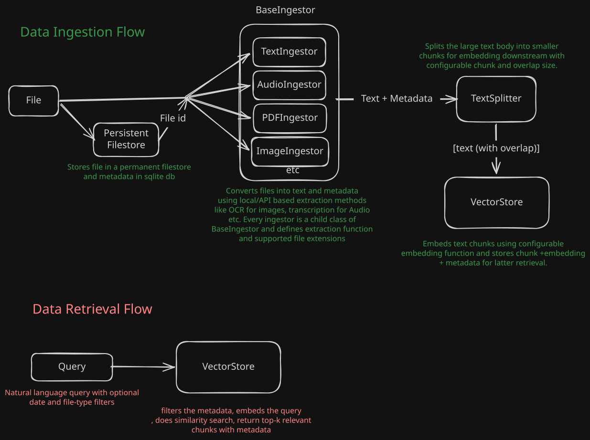

# FindMyFiles Data Flow

## Ingestion pathway

1. The Gradio frontend sends `POST /upload/` to the FastAPI backend.
2. `backend.app.upload_file()` wraps the upload as `IngestableFile`.
3. `FILE_STORE` persists the original file and `APP_STATE` records `Storage Complete`.
4. The backend queues `process_ingest_file` through Celery and Redis.
5. The worker selects an implementation from `BaseIngestor.ingestor_map` using the file extension.
6. The selected ingestor returns extracted text and `Metadata`.
7. `BaseChunker.split_text()` divides the extracted text into chunks.
8. `BaseVectorStore.add()` sends chunks and metadata to ChromaDB, where the configured embedding function creates vector representations.
9. `APP_STATE` records `Ingestion Complete`, `Chunking Complete`, `Embedding Complete`, and `Ingestion Successful`, or records a failure at the relevant boundary.

## Retrieval pathway

1. The frontend sends `POST /search/` with a query, `k`, and optional extension/date filters.
2. FastAPI validates `SearchRequest` and `build_where()` converts filters to a vector-store constraint.
3. `ChromaDBVectorStore.get()` performs nearest-neighbor search over embedded chunks.
4. `shape_search_response()` converts raw vector-store output into ranked chunks and grouped file summaries.
5. The frontend displays results and uses file IDs to retrieve original files through `GET /file/{file_id}`.

## Abstraction principles

### Ingestor abstraction

`BaseIngestor` defines the extraction contract: `extract_text(file) -> (text, Metadata)`. Concrete implementations can change by file type without changing the worker orchestration:

- `TextIngestor` handles text and Markdown.
- `PdfIngestor` handles selectable PDF text and OCR fallback.
- `ImageOCRIngestor` handles RapidOCR and optional vision captions.
- `AudioIngestor` handles local Whisper or API transcription.

The extension registry maps formats to implementations. Errors are expressed through `IngestionError`.

### Chunker abstraction

`BaseChunker` defines `split_text(text) -> list[str]`. `RecursiveChunker` is the current implementation and delegates boundary behavior to LangChain's recursive splitter. New chunking strategies can implement the same contract and be selected by configuration or an evaluation harness.

### Vector-store abstraction

`BaseVectorStore` defines `add()` and `get()`, while `ChromaDBVectorStore` owns the ChromaDB client, collection, metadata serialization, and embedding-function injection. This allows evaluation runs to swap embedding functions and client factories without changing API routes.

### Storage and state separation

`FILE_STORE` owns original file bytes and file metadata. `APP_STATE` owns ingestion lifecycle records. `VECTOR_STORE` owns derived chunks and embeddings. Keeping these concerns separate allows vector indexes to be rebuilt from original files and makes failure states observable.

### Runtime composition

`backend.config` composes the production singletons. API routes coordinate request-level work, Celery performs long-running ingestion, and Redis transports tasks.
